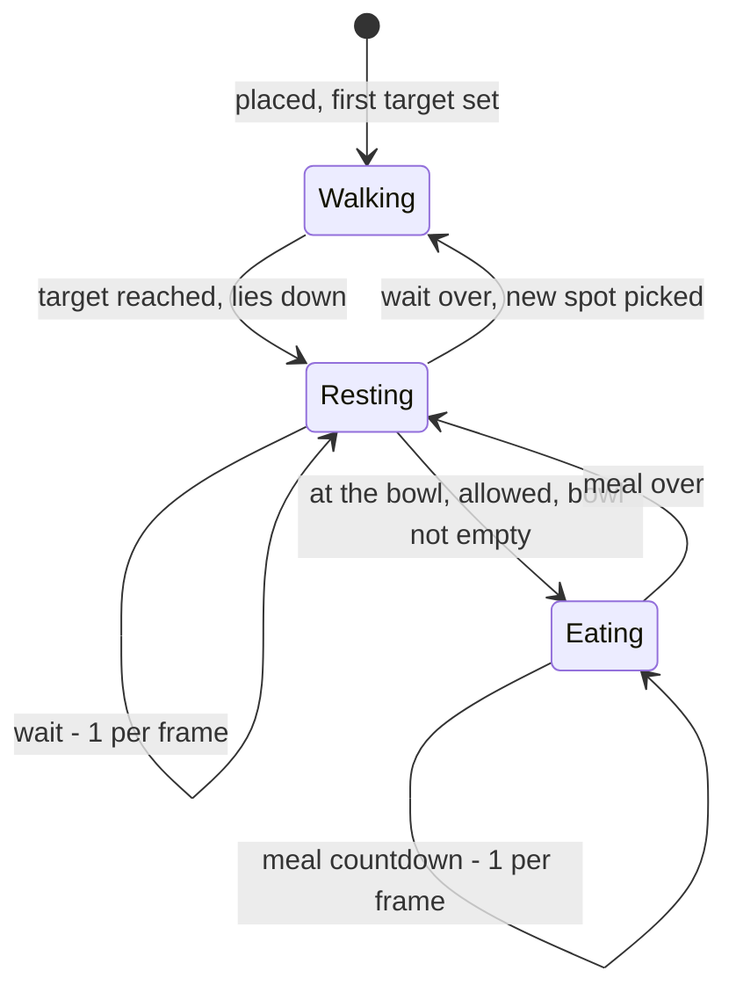

# Little Computer People — The Dog

The dog shares the house with the resident but lives a much simpler life: it
wanders from spot to spot, lies down, and eats when its bowl has food in it.
It never reacts to the resident or the player; the only way to affect it is
through the food bowl.

Everything here was read from the C port in `source/`, which compiles to a
binary byte-identical to the 1985 release.  Names are the port's (see
[NAMEMAP.md](NAMEMAP.md) for the older Ghidra names).  For the house, the
time base and the resident see [PEOPLE.md](PEOPLE.md); how the dog is drawn
-- its frames, and when it appears in front of or behind the resident -- is in
[RENDERING.md](RENDERING.md).

## Where the dog lives in the code

The dog has no activities and no decision ladder.  Its whole life runs inside
the compositor, `renderFrame` ([`parts/renderFrame.c`](../source/parts/renderFrame.c)),
once per frame (8 frames a second).  `moveDog`
([`parts/moveDog.c`](../source/parts/moveDog.c)) moves it one step towards its
target; the rest is a small state machine:

- **Picking a spot:** one of the nine wander spots, never the last one; spot 5
  (beside the bowl) sets `dogMayEat`.  The next wait, `dogIdleCount`, is drawn
  at the same time: 20..200 frames.
- **At the bowl** means x below 20 and y above 160, on the kitchen floor.
- **The meal** lasts 82..100 frames (`dogEatCount`); the bowl drops a level at
  60, 30 and 4 and once more at the end, which also clears `dogMayEat`.

The wait is drawn when the spot is picked, but only counts down once the dog
has arrived; after a meal it continues from where it was.

Because this runs from the frame loop, the dog keeps moving while the resident
is busy, asleep, or playing a game with the player.

## A day in the dog's life

### Arrival

For a new resident the dog is hidden (`dogHidden`) throughout the move-in
cutscene.  At its end it is let in at the living-room fireplace (273, 190),
lying down, with its first target in front of the front door and a 20-frame
wait.  When a saved game is loaded instead, `placeDog`
([`dog.c`](../source/dog.c)) puts it in the kitchen at (100, 195) and it sets
off at once.  The dog is not part of the save file.

### Wandering

When it has nothing to do (no target, not eating) the dog waits out
`dogIdleCount`, then picks one of nine spots in `dogRoamSpots`
([`dat_anim.c`](../source/dat_anim.c)) at random -- never the same one twice
running -- adds a small per-spot nudge, and sets off.  The next wait is drawn
at the same time: 20..200 frames, 2.5 to 25 seconds after it arrives.

| # | Spot | Where | Nudge |
|---|---|---|---|
| 0 | `POS_TOP_LIVING_ROOM` | top floor, in front of the TV | y +3 |
| 1 | `POS_TOP_ARMCHAIR_BACK` | top floor, beside the blue armchair | y +9 |
| 2 | `POS_TOP_DESK_FRONT` | top floor, in front of the writing desk | y +2 |
| 3 | `POS_MID_BEDROOM_WALK` | bedroom, by the alarm clock | y +10 |
| 4 | `POS_MID_COMPUTER_DESK` | the computer corner | x +10, y +6 |
| 5 | `POS_BTM_BOWL_SIDE` | kitchen, by the left wall next to the bowl | -- |
| 6 | `POS_BTM_DOG_BOWL` | the dog bowl | -- |
| 7 | `POS_BTM_WATER_TAP` | the water cooler | y +11 |
| 8 | `POS_BTM_SCREEN_EDGE` | in front of the front door | y +3 |

While the resident plays a game with the player, the card table covers the
top 77 screen lines -- the whole top floor -- so `playGame` sets
`dogNoTopFlr` and the dog only picks spots 3..8.

When it arrives, the dog lies down (`SPRITE_DOG_LAY_DOWN`) until its wait is
over.

### Eating

Picking spot 5, beside the bowl, gives the dog permission to eat
(`dogMayEat`).  Once it is standing still there -- x below 20 and y above
160, on the kitchen floor -- and the bowl is not empty, it eats for 82..100 frames
(10 to 12 seconds), cycling the three eating frames.  The bowl goes down one
level at frames 60, 30 and 4 of the countdown and once more when it finishes,
so a single meal always empties even a full bowl.  The permission is used up
by the meal; arriving at the bowl itself (spot 6) does not grant it.  If the
bowl was empty, though, the permission is kept until a meal happens, so the
dog may later eat at spot 6 too (see [BUGS.md](BUGS.md)).

The bowl has three states, `BOWL_EMPTY`, `BOWL_HALF` and `BOWL_FULL`
(`bowlLevel`).  `gameTick` ([`tick.c`](../source/tick.c)) draws it beside the
stove every tick and applies the changes the dog's meals and the resident's
feeding request through `bowlChange`.  The bowl level is saved with the rest
of the house state.

## How the dog is fed

Only the resident fills the bowl, always to full (`feedDog`,
[`parts/feedDog.c`](../source/parts/feedDog.c)):

- **On his own** (`ACTION_FEED_DOG`): one of the sixteen entries of his
  "active" idle table.  He takes dog food from the fridge, fills the bowl --
  empty or not -- and puts the package back.  The fridge never runs out.
- **Dog food delivery** (Ctrl-D): he fetches the package from the front door;
  if the bowl is empty he fills it, otherwise he puts the package in the
  fridge (`dogFoodDelivery` -> `foodDelivery`).

Typing FEED THE DOG (or FILL THE BOWL, OPEN A CAN) does nothing: the parser
accepts the request, but it names the delivery event rather than
`ACTION_FEED_DOG`, and `runAction` ignores it (see [PEOPLE.md](PEOPLE.md),
"Typed requests").

So in practice: the dog eats only every few minutes, when its random walk
happens to take it to spot 5, and the bowl is refilled when the resident feels
like it or the player orders dog food.

## What the dog does not do

The dog never reacts to the resident or the player.  Nothing in the game sets
its target from outside the wander picker, so it never comes when called,
never follows the resident and never reacts to Ctrl-P -- that key pats the
**resident**, while he crouches or reads in the armchair by the phone
(`crouchForPat`, `waitForPat`, `readInArmchair`, see [PEOPLE.md](PEOPLE.md)).
Older notes call those activities `callDog`, `petDog` and `sitWithDog`, after
what the first analysis guessed; none of them touches the dog.

## Moving

### Routing

`dogNextWaypt` ([`parts/dogNextWaypt.c`](../source/parts/dogNextWaypt.c)) works
like the resident's `nextWaypoint`: on the same floor the target itself is the
waypoint; otherwise the dog walks to the foot or head of the staircase on its
floor (`stairWaypts`) and then climbs or descends one flight at a time.  Two
small differences: entering the stairs from the top floor shifts it 8 pixels
left, and going down from the middle floor it aims 3 pixels further left at
the landing.

### Walking

`moveDog` moves the dog **one pixel per frame** -- 8 pixels a second, the
resident's healthy speed:

- **On a floor:** x steps towards the waypoint; y keeps to the floor's walking
  line (`floorWalkY`) and only turns towards the waypoint's y within 8 pixels
  of it horizontally.
- **On the stairs:** fixed patterns by y.  On a flight it moves one pixel up
  or down per frame and two sideways (none on the last walk frame, which
  makes the climb uneven); at y = 161 and y = 100 it jumps from one flight
  onto the next.
- It leaves stair mode once it has reached the floor of its waypoint.

## State

| Variable | Meaning |
|---|---|
| `dogX`, `dogY` | position |
| `dogXTarget`, `dogYTarget` | current target; both 0 = idle |
| `dogXWaypt`, `dogYWaypt` | current waypoint |
| `dogOnStairs` | on a staircase |
| `dogStepIdx` | walk frame, 0..7 |
| `dogIdleCount` | frames to wait before the next target |
| `dogLastPick` | last spot picked |
| `dogNoTopFlr` | keep off the top floor (during games) |
| `dogMayEat`, `dogEating`, `dogEatCount` | the eating permission, the meal, its countdown |
| `bowlLevel`, `bowlChange` | the bowl, and the step to apply to it this tick |
| `dogHidden` | not yet in the house (move-in) |

## Source reference

| Topic | Source |
|---|---|
| Wander picker, eating | [`parts/renderFrame.c`](../source/parts/renderFrame.c) |
| Movement | [`parts/moveDog.c`](../source/parts/moveDog.c), [`parts/dogNextWaypt.c`](../source/parts/dogNextWaypt.c), [`parts/floorOfY.c`](../source/parts/floorOfY.c) |
| Start position | [`dog.c`](../source/dog.c), [`parts/moveInScene.c`](../source/parts/moveInScene.c) |
| Tables | [`dat_anim.c`](../source/dat_anim.c) (`dogRoamSpots`, nudges, `dogEatFrames`), [`dat_world.c`](../source/dat_world.c) (`dogWalkSprites`, `stairWaypts`, `floorWalkY`) |
| The bowl | [`tick.c`](../source/tick.c), [`parts/feedDog.c`](../source/parts/feedDog.c), [`parts/foodDelivery.c`](../source/parts/foodDelivery.c) |
