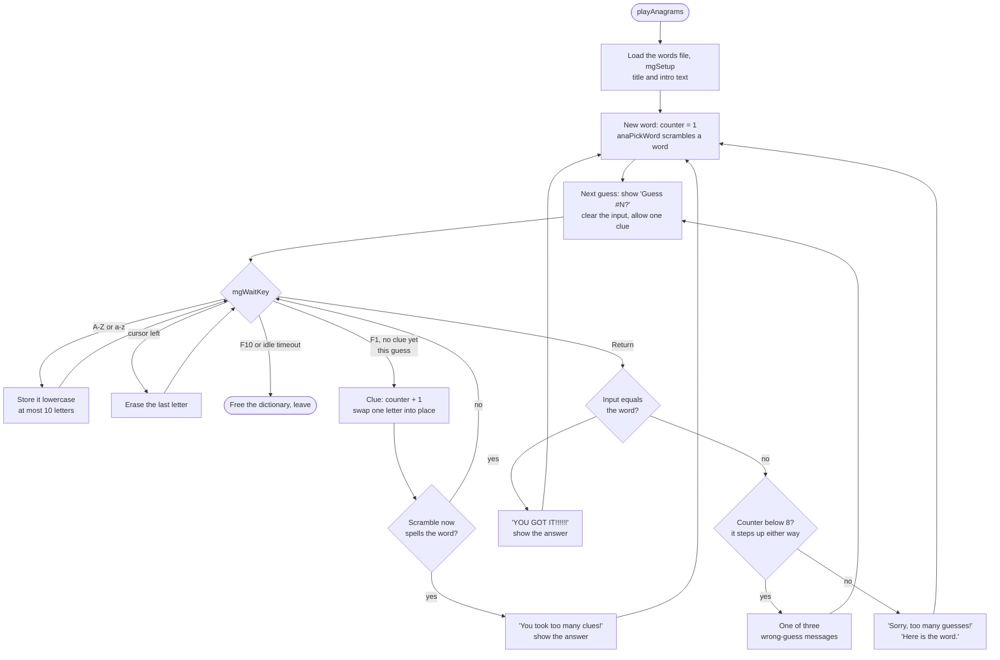
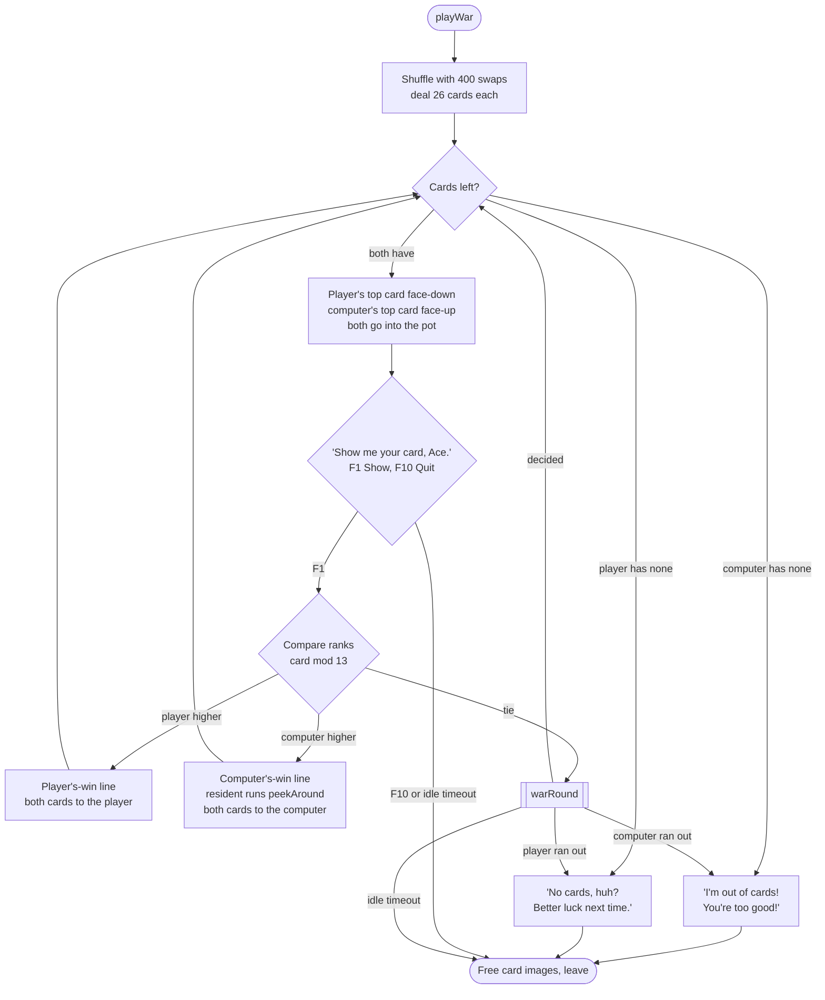
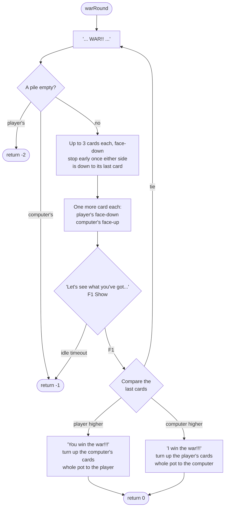
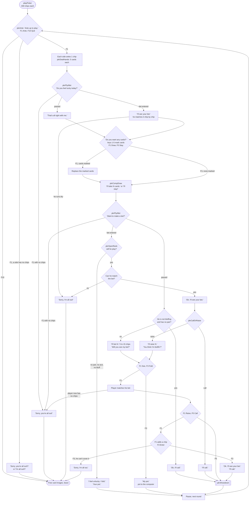
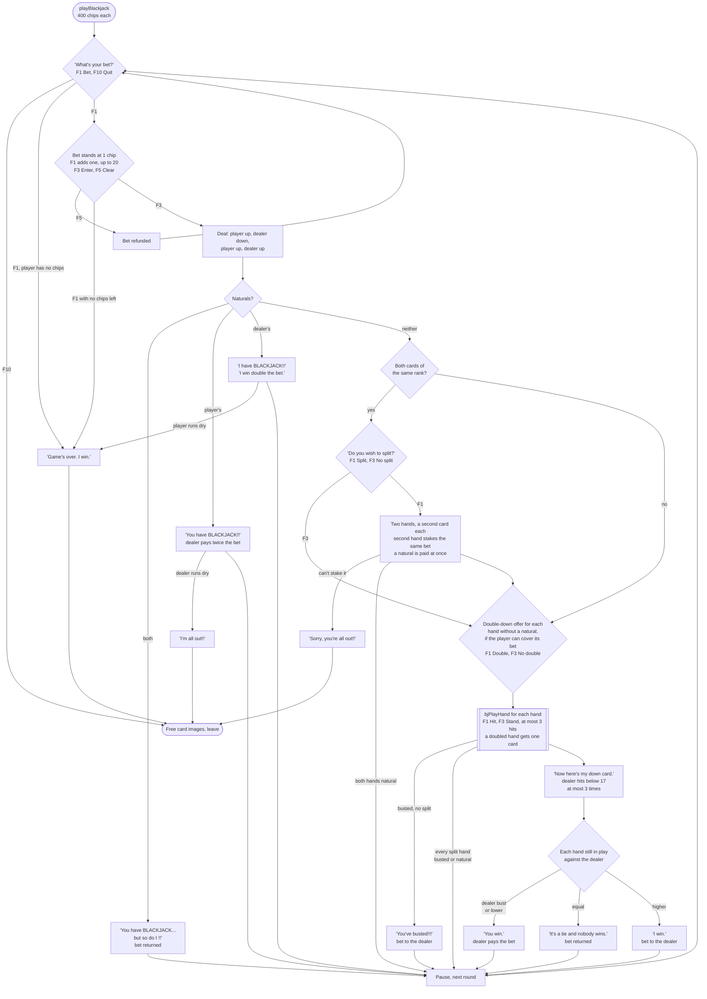
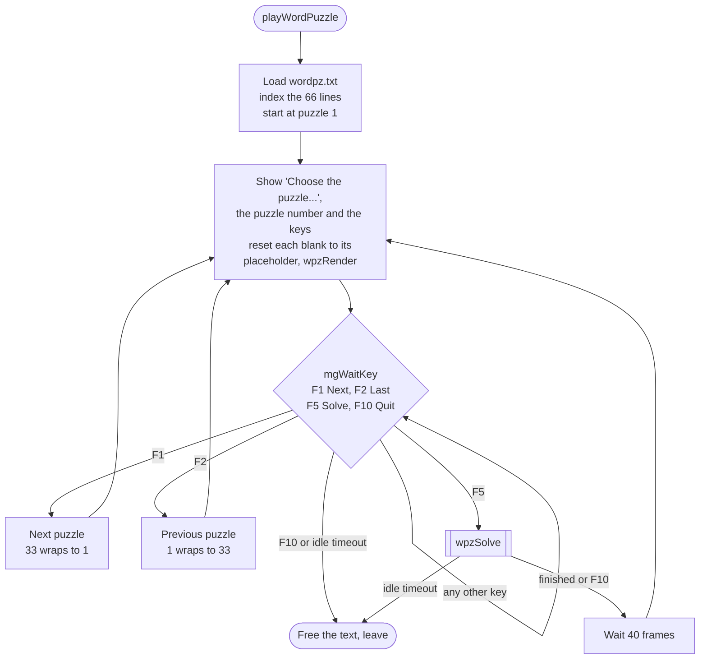
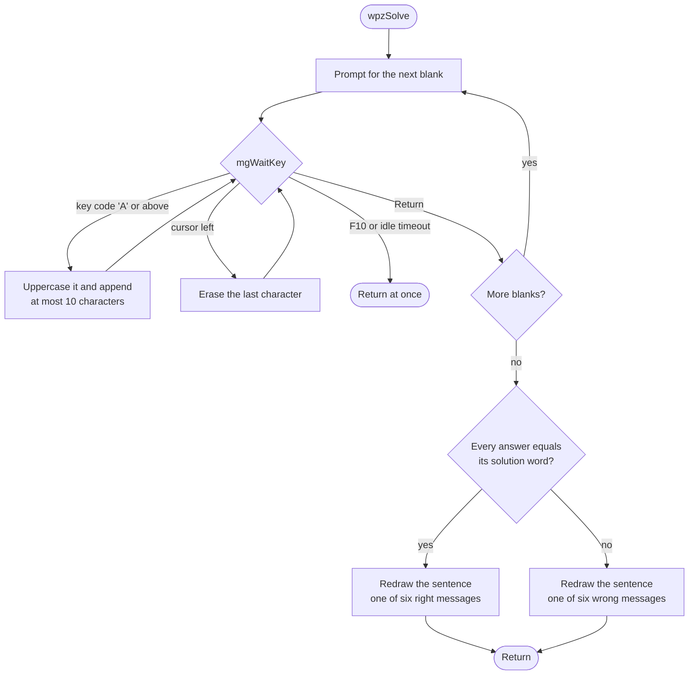

# Little Computer People — Mini-Games

The LCP character can play five mini-games at the game table. The player selects a game
by pressing keys 1–5 when prompted:

```
What game do you want to play?
1. Anagrams   2. War  3. Poker
4. Blackjack  5. Word Puzzles
```

The LCP walks to the filing cabinet, retrieves a game box (SPRITE_GAME_BOX), carries it
to the kitchen table, sits down (STATE_EAT_BITE with +8y/+6x offset), and launches the
selected game. On exit, the LCP picks up the box and returns it to the cabinet.

All mini-games share a common framework:
- `mgSetup()` fills the top 77 rows with background, freezes text scroll
- `mgWaitKey()` handles input while processing urgent game events
  (alarm, bathroom, thirst, doorbell) — the LCP leaves the table, handles the event, returns
- Auto-quit after 7,200 frames (~15 min) of inactivity, sets `mgTimedOut`
- Card graphics loaded from `cards` data file (52 cards + card back, 53 MFDB blocks)

Screen resolution: 320×200 pixels, 16 colors, Atari ST low resolution.

---

## 1. Anagram Game

**Entry point:** `playAnagrams()` (0x181AE)
**Data file:** `words` — 150 words × 11 bytes each (compressed)

### Concept

The computer selects a random word from a 150-word dictionary, scrambles its letters,
and challenges the player to unscramble it. The player has eight guesses and can
request letter clues, one per guess, each of which uses up a guess.

### Data Structures

| Variable | Type | Purpose |
|---|---|---|
| `anaDict` | char* | 10,000-byte buffer for decompressed dictionary |
| `anaAnswer` | char* | Pointer into dictionary for current word |
| `anaScrambled` | char[11] | Working copy with shuffled characters |
| `anaWordLen` | short | Length of current word (max 10) |
| `anaInput` | char[11] | Player's typed guess |
| `anaGuessNum` | short | Guess counter (1–9): wrong guesses and clues both advance it |
| `anaNumClues` | short | Total clues used (cumulative) |
| `anaExtraGuess` | short | Flag: set when a clue pushes the counter to 9 (has no effect, see below) |
| `anaClueUsed` | short | Flag: prevents >1 clue per guess |

### Dictionary Format

Each word is stored as a fixed 11-byte record. Words are terminated by either a period
(`.`) or a space character. The file is loaded compressed via `unpackFile()`
and decompressed into a 10,000-byte heap buffer. Words are accessed by index:
`anaDict + (index * 11)`.

### Scrambling Algorithm (`anaPickWord`)

1. Pick random index 0–149
2. Copy word characters into `anaScrambled` (stop at `.` or space)
3. Store null terminator; also null-terminate the original (replacing delimiter)
4. Scramble loop:
   - Generate random swap count (10–20)
   - For each swap: pick two random positions, exchange characters
5. Compare scrambled with original via `anaStrMatch()`
6. If still identical → repeat scrambling (ensures puzzle is solvable)
7. Display in large green text via `anaShowWord()`

### Clue Algorithm (F1 key)

When the player presses F1 (once per guess, only if word not yet fully revealed):

1. Scan left-to-right for first position where `scrambled[i] != original[i]`
2. Search backwards from end of `scrambled` to find where `original[i]` currently sits
3. Swap those two positions in `scrambled`
4. Redisplay the (partially unscrambled) word
5. If `scrambled` now equals `original` → "You took too many clues!" and round ends

This progressively reveals the word from left to right, one letter per clue.

### Game Flow



- **How many guesses.** One counter, `anaGuessNum`, counts wrong guesses and clues
  together.  A wrong answer submitted while it stands at 8 or more ends the word, so
  without clues the player gets eight guesses (#1 to #8), and every clue taken costs
  one of them.  "Guess #9?" appears only when a clue is taken during guess #8: that
  guess can still be submitted, and a wrong answer to it ends the word.
- **`anaExtraGuess` does nothing.**  The clue code sets it when the counter reaches 9,
  and the guess loop's condition (`anaGuessNum < 9`, or `< 10` while the flag is set)
  would allow a ninth guess for it.  But that condition is tested only once per
  guess, right after the flag has been cleared, and the counter is never above 8
  there; every way out of a guess is a `goto`, so it is never tested again.
- **Clues** are allowed once per guess (`anaClueUsed` is cleared when each guess
  starts); once used, the header drops "F1 Clue" until the next guess.  Other keys,
  and F1 after the clue, are ignored.
- **Typing**: capitals are folded to lowercase.  After ten letters the cursor stays
  on the tenth, so further letters overwrite it.
- **Wrong-guess messages** (picked with `rndRng(0, 2)`): "Nope, have another try.",
  "Sorry, try again.", "Missed, try again."

### Screen Layout

```
+---------------------------+-----------------------------+
|  ***ANAGRAMS***           | F1 Clue, F10 Quit           |  y=0-9
+---------------------------+-----------------------------+
|  I am thinking of         |                             |  y=10-49
|  a word. Here it          |   S C R A M B L E D        |  (large green text
|  is jumbled up...         |     (20px tall)             |   at x=162, y=37)
|  See if you can           |                             |
|  guess what it is.        |                             |
+---------------------------+-----------------------------+
|                           | Guess #1?                   |  y=50-65
|                           | [player input]              |
+-----------------------------------------------------------+
|  YOU GOT IT!!!!!!         (or wrong guess message)      |  y=62-75
+-----------------------------------------------------------+
```

### Helper Functions

| Function | Address | Purpose |
|---|---|---|
| `anaPickWord` | 0x18084 | Pick and scramble random word |
| `anaStrMatch` | 0x17538 | Case-sensitive string compare (1=match, 0=different) |
| `anaShowWord` | 0x18004 | Display word in 20px tall letters at (162,37) |
| `anaClrWord` | 0x17E9C | Clear right panel (162,10)-(319,49) |
| `anaIntroText` | 0x17F84 | Print 5-line intro in left panel |
| `anaDrawPrompt` | 0x18052 | Show "Guess #N?" from lookup table |
| `anaClrGuess` | 0x17F10 | Clear prompt area (166,50)-(319,65) |
| `anaClrBottom` | 0x17F4A | Clear status bar (5,62)-(319,75) |

---

## 2. Card Games (War, Poker, Blackjack)

The three card games share a common infrastructure: card graphics (`cards` data file),
display routines, input handler, and money/pot tracking.  The analysis this
document began as named all of them `poker_*`; each game is distinct.

### Shared Infrastructure

**Card representation:** Each card is a `CARD_TYPE` value 0–51:
- Rank = `card % 13` (0=2, 1=3, ..., 8=10, 9=J, 10=Q, 11=K, 12=Ace)
- Suit = `card / 13` (0=Hearts, 1=Diamonds, 2=Clubs, 3=Spades)
- `CARD_NONE` (0xFF) = empty slot; `CARD_BACK` = face-down display

**Card graphics:** 53 MFDB blocks loaded from `cards` data file (52 face cards + 1 back).
Two display rows: top row for computer (y positions from `cardYComp[]`), bottom row
for player (from `cardYPlyr[]`). Up to 5 cards per row.

**Shared globals:**

| Variable | Purpose |
|---|---|
| `plyrChips` | Player's chip count (poker/blackjack) or card count (war) |
| `compChips` | Computer's chip count or card count |
| `potChips` | Current pot (chips in play) |
| `bjBetSplit` / `bjBetMain` | Current bet amounts |
| `cardQuit` | Set to YES when game should end |
| `cardImages` | Heap-allocated buffer for card MFDB image data |

**Shared functions:**

| Function | Address | Purpose |
|---|---|---|
| `cardLoad` | 0x1AB04 | Load `cards` file, build 53 MFDB blocks |
| `cardDraw` | 0x1AA64 | Draw one card at (row, position) |
| `cardKeyInput` | 0x1AC92 | Wait for F-key input, map to action codes |
| `cardMessage` | 0x1B0AA | Print message in status area |
| `dispCompChips` | 0x1AD26 | Show computer's chip/card count |
| `dispPlyrChips` | 0x1ADE6 | Show player's chip/card count |
| `dispPot` | 0x1AEA6 | Show current pot amount |
| `bjShowBet` | 0x1D78E | Show bet amount with emphasis |
| `potToWinner` | 0x1A664 | Transfer pot to winner with animation |
| `pkrAddChips` | 0x1A840 | Move chips from player to pot |
| `panelErase` | 0x186E0 | Clear a screen rectangle |

---

### 2a. War

**Entry point:** `playWar()` (0x1B15C)
**Starting cards:** 26 each (full 52-card deck split evenly)

#### Concept

A simple card game: both players flip their top card, higher rank wins both cards.
On tie, a "war" round is played with multiple face-down cards and a final face-up
card deciding the outcome. The game ends when one player runs out of cards.

#### Data Structures

| Variable | Purpose |
|---|---|
| `plyrPile` (0x3F712) | Player's card pile (up to 52 cards) |
| `compPile` (0x47E24) | Computer's card pile |
| `plyrWarCards` (0x3C9DC) | Player's face-down war cards |
| `compWarCards` (0x3CC78) | Computer's face-down war cards |
| `plyrChips` | Number of cards remaining (starts at 26) |
| `compChips` | Number of cards remaining (starts at 26) |

Note: `plyrChips` and `compChips` represent **card counts** in War
(not money), since the shared globals are reused across all three card games.

#### Deck Initialization

1. Fill array with cards 0–51 in order
2. Shuffle by performing 400 random swaps
3. Deal alternating: even indices → computer pile, odd indices → player pile
4. Each player starts with 26 cards

#### Game Flow



- **Player wins**: with an ace, "Ace? I don't believe it!"; otherwise one of six at
  random: "You're awfully lucky!", "Arrghh!", "You're tough.", "I'll get you next
  time.", "Dog-gone it.", "All right. Slow down."
- **Computer wins**: the first rule that fits picks the line.  His card is an ace:
  "Ace takes it!".  He wins by one or two ranks: "Whew! That was too close." or
  "Hmm... That's not too bad!".  By seven or more: "No contest. You lose!", "Beat
  you by a mile." or "That was easy!".  The player's card is a 2 to 5: "That's an
  easy card to beat." or "Not a very high card, but I'll take it.".  The player's
  card is a J, Q or K: "Great, a face card, and it's mine now!".  Otherwise
  "Alright. I win!", "Better luck next time." or "Hey... look at that!".
- **peekAround** runs only when the computer wins a round: the resident glances
  aside while his line is on screen.  His head frame and mode are saved around it.
- Running out of cards is checked only at the top of a round (and of each war
  pass), before any card is drawn; the computer's pile is checked first.

#### War Sub-Game (on tie)

When both players flip the same rank, `warRound` plays a war.  It is a loop, not a
recursion: a tie in the war just goes round again with the next set of cards.



- The pot holds every card in play: the two tied cards plus everything laid down in
  the war, so one full war is worth 10 cards and each further tie adds up to 8.
- There is no quit key during a war: F10 is ignored, only the idle timeout gets out.
- Cards are taken from the piles with `popCard()` and handed to the winner with
  `pushCard()`.

#### Screen Layout

```
+------+------+------+------+------+---------+-------------------+
| Computer's card (face-up)        | $nnn    | Status messages    |
|  row 0: cardYComp[]          | (cards) |                    |
+------+------+------+------+------+---------+-------------------+
|                                  | Pot:nnn |                    |
+------+------+------+------+------+---------+-------------------+
| Player's card (face-down→up)     | $nnn    | F1  Show           |
|  row 1: cardYPlyr[]          | (cards) | F10 Quit           |
+------+------+------+------+------+---------+-------------------+
|  "Show me your card, Ace."                                      |
+------------------------------------------------------------------+
```

---

### 2b. Five-Card Draw Poker

**Entry point:** `playPoker()` (0x18D10)
**Starting chips:** 400 each

#### Concept

Standard 5-card draw poker with computer AI. Players ante, receive 5 cards, bet,
optionally discard and draw new cards, bet again, then compare hands at showdown.
The computer has hand evaluation, bluff logic, and draw strategy.

#### Data Structures

| Variable | Purpose |
|---|---|
| `plyrHand[5]` (0x3CCF0) | Player's 5-card hand |
| `compHand[5]` (0x3D11E) | Computer's 5-card hand |
| `compScoring[5]` | Per-card flags: 1=part of scoring combo (computer) |
| `plyrScoring[5]` | Same for player |
| `compSorted[5]` | Sorted hand by rank (computer) |
| `plyrSorted[5]` | Same for player |
| `compRank` | Computer's hand rank (0–9) |
| `pkrSelected[5]` | Cards selected for discard (1=selected) |
| `pkrDiscPile[]` | Discarded cards (prevents re-dealing) |
| `pkrNumDisc` | Number of discarded cards |
| `pkrBluffing` | YES if computer is bluffing this round |

#### Hand Ranks (`pkrEvalHand`, 0x18804)

| Rank | Name | Description |
|---|---|---|
| 0 | High Card | No combination |
| 1 | One Pair | Two cards of same rank |
| 2 | Two Pair | Two different pairs |
| 3 | Three of a Kind | Three cards of same rank |
| 4 | Straight | Five sequential ranks |
| 5 | Flush | Five cards of same suit |
| 6 | Full House | Three of a kind + pair |
| 7 | Four of a Kind | Four cards of same rank |
| 8 | Straight Flush | Sequential ranks, same suit |
| 9 | Royal Flush | Straight flush from ten to ace |

The evaluator sorts cards by rank (bubble sort), then checks for flush (all same suit),
straight (sequential ranks, with A-2-3-4-5 wrap), and counts rank groups for pairs/trips/quads.

#### Computer AI

**Bluff decision** (`pkrDecideBluff`): 1/15 chance of bluffing when hand rank < 2.

**Opening check** (`pkrOpenRank`): when bluffing or holding a pair or better, he
plays.  Otherwise he finds his highest card and folds unless it is an ace.

**Bet decision** (`pkrCallOrRaise`): Returns 99 (`'c'`, call) when he has no chips
left, or when he is not bluffing and holds less than two pair. Otherwise calculates
raise = his chips/10 (clamped to 1–20) and returns 114 (`'r'`, raise).

All three decisions read `compRank` and `pkrBluffing` as `pkrCompDraw` left them,
and it rates his hand *before* the replacement cards come in.

**Draw strategy** (`pkrCompDraw`):
- Four of a kind: keep all, draw 0
- Full house: keep all, draw 0
- Flush/straight: keep all, draw 0
- Three of a kind: keep trips, draw 2
- Two pair: keep both pairs, draw 1
- One pair: keep pair, draw 3
- High card: keep highest, draw 4
- Bluffing: draw 0–2 cards at random, taken from the cards outside his scoring combination

#### Game Flow



- **Idle timeout** at any prompt leaves the game at once, as F10 does at the ante.
- **Betting** (`pkrPlyrBet`, keys F1 Bet, F3 Enter, F5 Pass/Clr): F5 before any bet
  passes.  The first F1 bets a chip and returns -1 if the player has none.  After
  that F1 adds a chip, F3 enters the bet and F5 takes the bet back (a second F5
  then passes).  `pkrAddChips` stops adding at 20 chips per bet.
- **The first bet is always seen**: the resident matches it, and the game ends
  with "Sorry, I'm all out!" if he cannot.
- **Drawing**: keys 1 to 5 toggle a card (a marked card shows the highlight
  image); F3 Stay is drawn red when nothing is marked and grey otherwise.  F1 with
  nothing marked and F3 with something marked are ignored.  New cards are drawn from
  those in neither hand nor the discard pile.
- **When the player checks** in the second round and the resident is not
  bluffing with a high-card hand, he calls at once; otherwise he bets
  `rndRng(5, 15)` chips, at most what he has.
- **Raising**: the first F1 at "F1 Raise" starts a raise of one chip; F3 Enter is
  read only after that.  The raise counter keeps counting F1 presses past the
  20-chip cap and skips the press that spends the player's last chip, and the
  resident matches the counter, his own transfer again capped at 20.  When the
  player saw a bet after checking, the shortfall message is the misspelt
  "Sorry, I,m all out."
- **Showdown** (`pkrShowdown`): reveals his hand, rates both with `pkrEvalHand`
  and compares ranks.  Equal ranks are broken by the top card (straights and
  flushes), the rank of the set (three or four of a kind, full house), the high pair,
  low pair and then the odd card (two pair), or the pair and then the cards from the
  top down (one pair, high card).  A complete tie goes to the player.  The winner's
  line is "I win!!!" or "You're so lucky!!!"; the winning hand blinks five times
  and `potToWinner` moves the pot.
- **Game end**: a side out of chips is caught at the next ante, or mid-round by
  one of the "all out" messages, which leave the game at once without settling the
  pot.

#### Screen Layout

```
+------+------+------+------+------+---------+-------------------+
| [##] | [##] | [##] | [##] | [##] | $nnn    | F1 Bet             |
| Computer's hand (face-down)      | (comp)  | F3 Enter           |
+------+------+------+------+------+---------+ F5 Pass/Clr        |
|                                  | Pot:nnn | F10 Quit           |
+------+------+------+------+------+---------+-------------------+
| [5♠] | [K♥] | [K♦] | [3♣] | [7♠] | $nnn    |                    |
| Player's hand (face-up)          | (player)|                    |
+------+------+------+------+------+---------+-------------------+
|  "Do you feel lucky today?"                                     |
+------------------------------------------------------------------+
```

---

### 2c. Blackjack (21)

**Entry point:** `playBlackjack()` (0x1BC72, 623 lines)
**Starting chips:** 400 each

#### Concept

Standard blackjack rules: get as close to 21 as possible without going over.
Aces can count as 1 or 11. Face cards (10/J/Q/K) count as 10.
Supports pair splitting and doubling down. A tie is a push: the bet is returned.

#### Card Values (`bjScore`, 0x1D1B4)

| Card | Value |
|---|---|
| 2–9 (rank 0–7) | Face value (rank + 2) |
| 10, J, Q, K (rank 8–11) | 10 |
| Ace (rank 12) | 1 or 11 (aceMode parameter) |

The `aceMode` parameter controls ace handling:
- 0 = all aces count as 1
- 1 = first ace counts as 11, subsequent aces count as 1

#### Data Structures

| Variable | Purpose |
|---|---|
| `plyrHand[5]` | the player's main hand |
| `bjSplitHand[5]` | the player's split hand, after splitting a pair |
| `compHand[5]` | the dealer's (the resident's) hand |
| `bjHitsMain`, `bjHitsSplit`, `bjHitsDealer` | hits a hand may still take (the player's start at 3) |
| `bjBetMain`, `bjBetSplit` | chips bet on each of the player's hands |
| `bjDidSplit` | YES once the player has split |
| `bjNatMain`, `bjNatSplit` | a hand is a natural blackjack |
| `bjBustMain`, `bjBustSplit` | a hand has bust |
| `bjDblMain`, `bjDblSplit` | a hand has doubled down |
| `bjDealerScore`, `bjPlyrScore` | final scores |

#### Natural Blackjack Detection (`bjIsNatural`, 0x1D608)

Checks if the initial 2-card deal contains an ace (rank 12) paired with a face card
(rank 8–11, i.e., 10/J/Q/K). Returns 1 if natural blackjack, 0 otherwise.

#### Game Flow



- **Idle timeout** at any prompt leaves the game at once, as F10 does at the bet
  prompt.
- **The resident stakes nothing.**  Only the player's bet sits in the middle panel;
  `bjSettle` pays a win out of the dealer's chips.  Payouts: a win pays the bet
  (1:1); a player's natural pays twice the bet (2:1); the dealer's natural takes the
  bet and as much again from the player's chips; ties and double naturals return
  the bet.
- **F5 Clear** refunds the bet and starts the bet prompt over.  The code passes
  that through `pkrDiscPile[10]`, poker's discard pile, as a flag.
- **Split**: the second card moves to `bjSplitHand`, each hand gets a new second
  card, and the player stakes the first hand's bet again for the second.  The
  prompts and messages name the hands: "Here is your first hand.", "Double-down on
  your first hand?", "Need a hit on your first hand?", "Your first hand is busted
  !!", "You win with your first hand.", "First hand ties, nobody wins.", "Your first
  hand loses." (and the same for the second hand).  Without a split the prompts are
  "Do you wish to double-down?" and "Do you want a hit?".
- **Doubling down** doubles the hand's bet and deals it exactly one card ("Here's
  your card.").  The offer is skipped when the player cannot cover the bet.
- **Hits** (`bjPlayHand`): every hand may take three hits, five cards in all;
  after the third, "You cannot take any more cards."  A hand busts when it is over
  21 with every ace counted as 1.
- **The dealer** counts one ace as 11 when that keeps him at 21 or below, so he
  stands on a soft 17 ("I'll stand.").  His hits are announced "I'll take a hit.",
  "I'll take another hit.", "I'll take one more."; over 21 is "I've busted !!".
  After three hits he stops, whatever his total.
- **Scores**: the player's hand also counts one ace as 11 when that stays at 21 or
  below.  The dealer busting wins every hand still in play.
- **The dealer going broke** ends the game only on the natural-blackjack path.  A
  normal win he cannot cover is paid as far as his chips go, and play goes on.

#### Pair Splitting

When the player's initial two cards have the same rank (e.g., two Kings):

1. Second card moved to `bjSplitHand`
2. First hand played fully (hit/stand)
3. Then second hand played with its own bet
4. Each hand checked independently for blackjack and bust
5. Both hands compared against dealer's hand separately

#### Screen Layout

```
+------+------+------+------+------+---------+-------------------+
| [##] | [##] |      |      |      | $nnn    |                    |
| Dealer's hand (face-down)        | (dealer)|                    |
+------+------+------+------+------+---------+-------------------+
|                                  | Pot:nnn |                    |
+------+------+------+------+------+---------+-------------------+
| [A♠] | [K♥] |      |      |      | $nnn    | F1 Hit             |
| Player's hand (face-up)          | (player)| F3 Stand           |
+------+------+------+------+------+---------+-------------------+
|  "Your turn."                                                   |
+------------------------------------------------------------------+
```

---

## 3. Word Puzzle Game

**Entry point:** `playWordPuzzle()` (0x176F8)
**Data file:** `wordpz.txt` — 33 fill-in-the-blank puzzles (compressed)

### Concept

Fill-in-the-blank word puzzles. The game displays a sentence with missing words
(marked by `@`), and the player types in guesses for each blank. After all blanks
are filled, the answers are compared against the solution.

### Data Structures

| Variable | Type | Purpose |
|---|---|---|
| `wpzText` | char* | 2,000-byte buffer for decompressed puzzle data |
| `wpzIndex` | short | Current puzzle number (0–32) |
| `wpzBlanks` | short | Number of `@` blanks in current puzzle |
| `wpzAnswers[][12]` | char[][] | Player's typed answers (up to 10 chars each) |
| `letterLines[66]` | char*[] | Parsed line pointers (2 lines per puzzle) |
| `wpzPrompts[9]` | char*[] | Prompts: "OK, what's the first word?", etc. |
| `wpzRightMsgs[6]` | char*[] | Success messages |
| `wpzWrongMsgs[6]` | char*[] | Failure messages |

### Puzzle File Format (`wordpz.txt`)

The file contains 33 puzzles stored as 66 lines (2 lines per puzzle):

- **Even lines** (0, 2, 4, ...): Template text with `@X` markers
  - Literal text is displayed as-is
  - `@` followed by a placeholder character marks a fill-in blank
  - The character after `@` is used as the initial display hint
- **Odd lines** (1, 3, 5, ...): Solution words separated by whitespace

Lines are delimited by control characters (ASCII < 32). The file is compressed and
decompressed into a 2,000-byte buffer. After loading, all 66 line start pointers are
stored in `letterLines[]`.

### Template Rendering (`wpzRender`, 0x17CAC)

The renderer walks the template string character by character:

1. **Space**: adds spacing (collapsed if at start of line)
2. **Literal text**: accumulates word characters, measures word length for word-wrap,
   prints each character individually in blue via `printChar()`
3. **`@` marker**: reads placeholder character, substitutes with player's answer from
   `wpzAnswers[answer_index][]`, prints in blue
4. **After answer**: checks the character 2 positions after `@` for trailing punctuation
   (period, comma, etc.) and renders it inline
5. **Word wrap**: if next word would exceed column 38 (x position > 0x26), wraps to
   next line (y += 8). Two display lines available (y=40 and y=48).

### Answer Comparison

After the player enters all answers, the solve phase compares each answer against
the solution line from `wordpz.txt`:

1. Walk the solution line, skip whitespace (ASCII < `!`) to find each solution word
2. Compare character-by-character with the player's answer
3. If all characters match and player answer is fully consumed → word is correct
4. All words correct → random success message from 6 options
5. Any word wrong → random failure message from 6 options

Comparison is **case-sensitive**: player input is converted to uppercase via
`toUpper()`, so solution words in the file must also be uppercase.

### Game Flow





- **Prompts**: the first blank gets one of five at random ("OK, what's the first
  word?", "Good luck! What's the first word?", "Alright. Type in the first word.",
  "This won't be easy! First word first.", "Here we go. What's the first word?");
  the later ones are "What's the second word?" through "What's the fifth word?".
- **Typing**: any key code from 'A' up is taken, so lowercase letters are folded to
  capitals, but F1 to F9 (codes 241 to 249) are stored as they are.
- **Comparing** stops at the first answer that differs from its solution word.  The
  right messages are "You got it!!", "Good going. That's right!",
  "Congratulations. That's it!", "I don't believe it!! You're right!", "You're
  pretty good. That's right!" and "You got that one. How about another?"; the wrong
  ones "Too bad. You missed it.", "Better luck next time.", "Good try, but that's the
  wrong answer.", "That's not it. How about another try?", "Nope." and "Not quite."
- Going back to the browse screen re-seeds every blank with its placeholder, so
  the player's answers are not kept.

### Screen Layout

```
+---------------------------+-----------------------------+
| **WORD PUZZLE # 12 **     | F1 Next, F5 Solve           |  y=0-9
+---------------------------+ F2 Last, F10 Quit           |
| Choose the puzzle         |                             |  y=10-26
| you wish to solve.        |                             |
+-----------------------------------------------------------+
|                                                           |  y=31-49
|  The quick brown [_____] jumped over the lazy [_____].    |  (template with
|                                                           |   blanks, blue text,
|                                                           |   word-wrapped)
+-----------------------------------------------------------+
|  OK, what's the first word?                               |  y=50-59 (prompt)
+-----------------------------------------------------------+
|  [player typing here]                                     |  y=60-69 (input)
+-----------------------------------------------------------+
```

### Helper Functions

| Function | Address | Purpose |
|---|---|---|
| `wpzSolve` | 0x1799E | Interactive answer entry and comparison |
| `wpzRender` | 0x17CAC | Render template with filled answers |
| `wpzMessage` | 0x17C78 | Display message in bottom prompt area |
| `toUpper` | 0x272E8 | Convert ASCII character to uppercase |

---

## Function Cross-Reference (All Mini-Game Functions)

### Anagram (9 functions)
| Address | Function |
|---|---|
| 0x181AE | `playAnagrams` |
| 0x18084 | `anaPickWord` |
| 0x17538 | `anaStrMatch` |
| 0x18004 | `anaShowWord` |
| 0x17E9C | `anaClrWord` |
| 0x17F84 | `anaIntroText` |
| 0x18052 | `anaDrawPrompt` |
| 0x17F10 | `anaClrGuess` |
| 0x17F4A | `anaClrBottom` |

### Card Games — Shared (11 functions)
| Address | Function |
|---|---|
| 0x1AB04 | `cardLoad` |
| 0x1AA64 | `cardDraw` |
| 0x1AC92 | `cardKeyInput` |
| 0x1B0AA | `cardMessage` |
| 0x1AD26 | `dispCompChips` |
| 0x1ADE6 | `dispPlyrChips` |
| 0x1AEA6 | `dispPot` |
| 0x1D78E | `bjShowBet` |
| 0x1A664 | `potToWinner` |
| 0x1A840 | `pkrAddChips` |
| 0x186E0 | `panelErase` |

### War (4 functions)
| Address | Function |
|---|---|
| 0x1B15C | `playWar` |
| 0x1B784 | `warRound` |
| 0x1B0E0 | `popCard` |
| 0x1B138 | `pushCard` |

### Poker (10 functions)
| Address | Function |
|---|---|
| 0x18D10 | `playPoker` |
| 0x18804 | `pkrEvalHand` |
| 0x1A8C2 | `pkrDealHands` |
| 0x1AF66 | `pkrAnte` |
| 0x1A6B8 | `pkrPlyrBet` |
| 0x187A0 | `pkrCallOrRaise` |
| 0x1A1BC | `pkrOpenRank` |
| 0x1A27A | `pkrCompDraw` |
| 0x1A24A | `pkrDecideBluff` |
| 0x19A3A | `pkrShowdown` |

### Blackjack (5 functions)
| Address | Function |
|---|---|
| 0x1BC72 | `playBlackjack` |
| 0x1D294 | `bjPlayHand` |
| 0x1D608 | `bjIsNatural` |
| 0x1D67C | `bjDealCard` |
| 0x1D1B4 | `bjScore` |

### Settling (1 function)
| Address | Function |
|---|---|
| 0x1D864 | `bjSettle` |

### Word Puzzle (5 functions)
| Address | Function |
|---|---|
| 0x176F8 | `playWordPuzzle` |
| 0x1799E | `wpzSolve` |
| 0x17CAC | `wpzRender` |
| 0x17C78 | `wpzMessage` |
| 0x272E8 | `toUpper` |

### Game Selection
| Address | Function |
|---|---|
| 0x21860 | `playGame` |
| 0x1759C | `mgSetup` |
| 0x173E8 | `mgWaitKey` |
