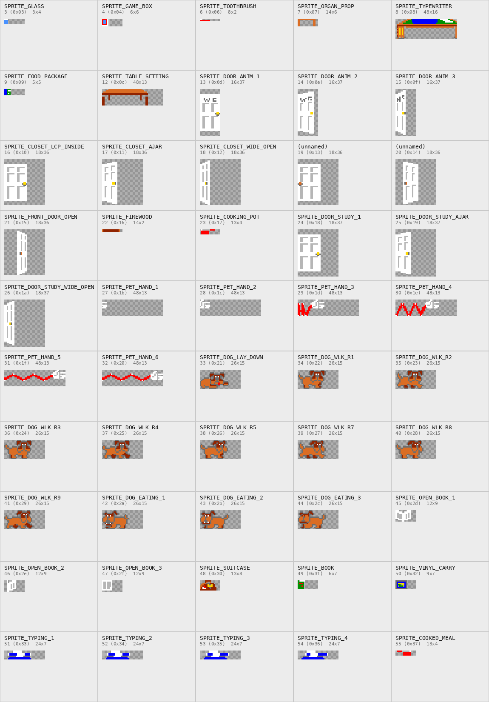

# Little Computer People — Rendering

How the picture on the screen is made: the house picture, the objects painted
into it, the compositor, the sprite slots, and how the resident and the dog
are drawn.  The file formats are in [IMAGEFORMAT.md](IMAGEFORMAT.md); what the
characters do is in [PEOPLE.md](PEOPLE.md) and [DOG.md](DOG.md).

Names are those of the C port in `source/`; file references are to it.

## Screens and buffers

The ST shows ST low resolution, 320x200 in 16 colours, four interleaved
bitplanes.  The game keeps three 32 000-byte pictures, each aligned to a
512-byte boundary:

| Buffer | Role |
|---|---|
| `houseBuf` (`housePtr`, `houseMfdb`) | the house picture: `HOUSE.SCN` decoded at start-up, plus every object painted since |
| TOS's screen (`tosPhysbase`) and `altScreen` | the two screens the compositor alternates between (`frameMfdb`) |
| `stripStore` (`stripBuf`) | the panel at the top of the screen: the typing strip, the letter paper, a minigame's card table |

VDI drawing (lines, bars, text) goes through the game's own bindings
([`vdistx.c`](../source/vdistx.c), `vdistx_a.s`).  `beginDraw`/`endDraw`
temporarily point the logical screen at the house picture, so lines drawn in
between become part of it; `panelBegin`/`panelEnd` do the same for the panel.

## The house picture

`HOUSE.SCN` is decoded once into `houseBuf` (`decodeScn`).  Everything in the
house that changes is painted into that picture rather than drawn each frame:

- **Objects** from the `OBJECTS` file, by `drawObject`
  ([`render.c`](../source/render.c)): doors, cabinets and drawers open and
  shut, the stove, the fire, the phone, the alarm clock, the clock pendulum,
  the dog bowl's three levels.  `OBJ_*` ([`include/enums.h`](../source/include/enums.h))
  numbers them; the `*_X`/`*_Y` furniture constants give where each is drawn.
- **Lines**: the clock hands (`drawHands`, redrawn each minute by
  `redrawHands`), the TV picture (`drawTvPicture`, random colours every tick
  while it is on), the computer's screen animations (`tvClearAnim`,
  `tvPattern`, `tvBounce`), the record player's needle and lights
  (`animRecPlayer`), the water tank level (`updateWaterTank`), and the food
  markers in the kitchen cabinet (`drawFoodCab`).

At start-up `main` paints every door and cabinet in its saved state.  Once
painted, an object stays until something paints over it.

## The compositor

`renderFrame` ([`parts/renderFrame.c`](../source/parts/renderFrame.c)) makes one
frame:

1. **Pacing.**  It returns at once unless 25 ticks of TOS's 200 Hz clock
   (125 ms) have passed and a vertical blank has happened since the last
   frame: at most 8 frames a second, never two in one blank.
2. **The dog and sound timing** run here (see [DOG.md](DOG.md) and
   [SOUND.md](SOUND.md)).
3. **Background.**  The house picture is copied into the frame being built,
   in 32-byte blocks (`copyBlocks32`, `blkcp_a.s`), depending on `textTimer`:
   - 0: the whole screen from the house picture (1000 blocks);
   - above 0, while a typed line or the letter is showing: the top 27 lines
     from the panel, the rest from the house;
   - below 0, during a minigame: the top 77 lines from the panel -- the card
     table, which hides the top floor -- the rest from the house.
4. **Sprites.**  Each of the eight hardware slots is promoted and drawn
   (below).
5. **Flip.**  After `Vsync`, the new frame is shown with `Setscreen`; then a
   queued sound effect is started (`startSfx`) and `frameMfdb` switches to the
   other screen for the next frame.
6. `frameCount` counts frames; the game's whole time base rests on it.

## Sprites

### Definitions

The 50 graphics in `SPRITES` become logical sprites at start-up: `main` walks
the file and `defineSprite` stores each under the id `spriteFileId` gives it
(`spriteBitmap`, `spriteMask`, `spriteWidth`, `spriteHeight`, ids up to 59).
Masks are not stored in the file: `makeMask` builds them, with colour 0
transparent.

All 50, with their names: [images/sprites.png](images/sprites.png)
(regenerate with `source/tools/spritesheet.py`).

| Ids | Sprites |
|---|---|
| 0, 1 | the resident's body and head (built every tick, see below) |
| 3, 4, 9, 22, 23, 48..50, 55 | things he carries: glass, game box, food package, firewood, cooking pot, suitcase, book, record, cooked meal |
| 6, 7, 8, 12 | the toothbrush, the prop on the organ, the typewriter at the desk, the place setting on the kitchen table |
| 13..15 | the toilet door, opening |
| 16..18 | the bedroom closet: with him inside, ajar, wide open |
| 19..21 | the front door; 21 (`SPRITE_FRONT_DOOR_OPEN`) is it wide open |
| 24..26 | the study door |
| 27..32 | the player's hand patting him |
| 33..44 | the dog: lying down, eight walking frames, three eating frames |
| 45..47 | the open book he reads in the downstairs armchair (`SPRITE_OPEN_BOOK_*`) |
| 51..54 | his hands at the typewriter |

### Layers and slots

Each logical sprite has a layer, `spriteLayer`: `SPRITE_HIDDEN`,
`SPRITE_BEHIND_LCP` or `SPRITE_IN_FRONT` (of the resident).  Eight hardware
slots carry what is actually drawn, in drawing order:

| Slot | Used for |
|---|---|
| 0 | the dog, behind the resident |
| 1, 2 | sprites behind the resident |
| 3 | the resident's body |
| 4 | the resident's head |
| 5, 6 | sprites in front of the resident |
| 7 | the dog, in front of the resident |

`layoutSlots` ([`sprites.c`](../source/sprites.c)) gives every visible sprite
a slot by its layer and records it in `spriteSlot`: within a layer the
lowest-numbered sprite gets the main slot (2 behind, 6 in front) and the next
one the other (1, 5), with its image moved over when the order changes.  Each
layer therefore shows two sprites at most.  Hidden sprites get
`HW_SLOT_NONE`.
`activateSprite` lays the slots out and puts a sprite's image straight into
its slot.

Doors and closets work this way: while the resident walks "through" a door,
the open door is a sprite in the front layer, so he appears behind it.

### Pending and drawn

Each slot has two sets of values.  The resident's body and head prepare the
next frame -- image, mask and size in `pendImage`, `pendMask`, `pendWidth`,
`pendHeight`, position in `drawnX`, `drawnY` -- and set `pendReady`.  When the
compositor sees `pendReady`, it promotes the slot: the image moves to
`drawnImage`, `drawnMask`, `drawnWidth`, `drawnHeight`, and the position the
other way, into `pendX`, `pendY`.  Other sprites write the drawn image and
`pendX`/`pendY` directly and take effect at once.

`drawSlot` draws a slot at `pendX`/`pendY` as a masked blit with two
`vro_cpyfm` calls: the inverted mask ANDed into the frame (`NOTS_AND_D`),
then the image XORed in (`S_XOR_D`).

## The resident

### Body and head

He is drawn every tick by `updateBody` and `updateHead`
([`parts/updateBody.c`](../source/parts/updateBody.c),
[`parts/updateHead.c`](../source/parts/updateHead.c)) into slots 3 and 4.

- **Body:** `animState` (93 states, `STATE_*`) selects one of 98 frames of
  `BODY.LCP` through `bodyIndex`; while he carries something, the walking
  states use `carryFrames` instead.  The frame is 32 pixels wide and 21 high,
  drawn at x - 4 (facing right) or x - 14 (facing left) and lifted or lowered
  per state by `bodyYOffset`.
- **Head:** one of the 66 frames of his `PEx.LCP` (`characterSpriteId` 2..6
  picks the file).  Each mood has 22: 7 for special faces and 3 tilts by 5
  directions; `moodHeadBase` selects the mood's block and `headFrame` the
  frame.  `headXOffset` and `headYOffset` place it on the body per state.

### Colours from bitplanes

Both are stored with two bitplanes and expanded to four by `expandFrame`
([`parts/expandFrame.c`](../source/parts/expandFrame.c)).  The body goes into
planes 0-1, so it uses colours 1..3, and palette slots 1 and 2 are his
clothes.  The head goes into planes 1-2, so it uses colours 2, 4 and 6, and
slot 6 is his skin.  Changing clothes or falling sick therefore needs only a
palette change.  Facing left, the frame is mirrored through `mirrorTable`, a
bit-reversal table built at start-up (`buildMirrorTable`).

Masks are built at start-up for every frame (`buildMasks`, `maskBody`,
`maskHead`) into `bodyShapes` and `headShapes`.

### Head movement

The head moves on its own.  Its pose `headPose` is a direction (8, from
front through right and back to left; 5..7 are mirrors of 3..1) and a tilt (3
rows), `HEAD_POSE(dir, tilt)`.  Every tick `stepHead`
([`parts/stepHead.c`](../source/parts/stepHead.c)) turns the pose one notch
towards `headTarget` (the short way round, `headTurnStep`) and turns it into
`headFrame` and the mirror flag `headMirror`.  When the target is reached it
waits 2..9 ticks and picks a new random one within the limits of `headMode`:
walking, reading and the computer each allow their own range of glances
(`HEAD_ANIM_*`).  Activities set `headTarget` and wait with `waitHeadTurn` to
make him look somewhere on purpose, or force a frame through `headFrame` to
nod or talk.

### Carried things

What he carries is a third sprite.  `carryBehind` and `carryInFront` put it in
a layer and set `isCarrying`; every tick `gameTick` places it at his hand, 20
lines above his feet: 10 pixels right of him when he faces right, its width
minus 16 pixels left of him when he faces left.

## The dog

`setDogSprite` ([`alerts.c`](../source/alerts.c)) draws the dog through the two
slots reserved for it, 0 and 7.  Both get its position (its top 17 lines above
`dogY`), size and mask; only one gets the image -- slot 0, behind the
resident, while the dog stands higher on the screen than he does
(`dogY + 5 <= resY`), slot 7 in front otherwise, and always in front while he
reads the newspaper or while the dog eats.  Facing left, `flipSprite` mirrors
the frame and its mask into `dogMirImage` and `dogMirMask`.  While the dog is
not yet in the house (`dogHidden`) nothing is drawn.

| Frames | Sprites |
|---|---|
| walking | `SPRITE_DOG_WLK_R1`..`R9` (0x22..0x29), eight in `dogWalkSprites`, one per frame |
| lying down | `SPRITE_DOG_LAY_DOWN` (0x21) |
| eating | `SPRITE_DOG_EATING_1..3` (0x2a..0x2c), `dogEatFrames` |

When the dog moves only vertically on a floor, `moveDog` never sets its
mirror flag, and the frame is drawn with whatever value that local happens to
hold.

## Colours

`mainPalette` holds the 16 colours.

| Slot | Use |
|---|---|
| 1, 2 | his clothes: `pickClothes` loads one of 16 pairs (`shirtPrimary`, `shirtSecondary`); `pickSkin` loads a skin tone into both when he undresses |
| 6 | his skin: `setSkinColor`, peach, or green while he is sick |

The drawing code names colours by palette slot (`COLOR_*`) and passes them
through `colorPens`, which maps them to the VDI pen numbers TOS's default
pen-to-slot permutation needs.

## Source reference

| Topic | Source |
|---|---|
| Compositor | [`parts/renderFrame.c`](../source/parts/renderFrame.c), [`parts/drawSlot.c`](../source/parts/drawSlot.c), `blkcp_a.s` |
| Objects | [`render.c`](../source/render.c) (`drawObject`, `drawFoodCab`) |
| Sprite slots | [`sprites.c`](../source/sprites.c), [`parts/activateSprite.c`](../source/parts/activateSprite.c), [`parts/defineSprite.c`](../source/parts/defineSprite.c), [`parts/makeMask.c`](../source/parts/makeMask.c) |
| The resident | [`parts/updateBody.c`](../source/parts/updateBody.c), [`parts/updateHead.c`](../source/parts/updateHead.c), [`parts/stepHead.c`](../source/parts/stepHead.c), [`parts/expandFrame.c`](../source/parts/expandFrame.c), [`tick.c`](../source/tick.c) |
| The dog | [`alerts.c`](../source/alerts.c) (`setDogSprite`, `flipSprite`) |
| Screens, panel | [`parts/initHouseBuf.c`](../source/parts/initHouseBuf.c), [`parts/fillPanel.c`](../source/parts/fillPanel.c), [`parts/beginDraw.c`](../source/parts/beginDraw.c), [`parts/panelBegin.c`](../source/parts/panelBegin.c) |
| Palette | [`renderx.c`](../source/renderx.c), [`health.c`](../source/health.c), [`dat_world.c`](../source/dat_world.c) |
| VDI bindings | [`vdistx.c`](../source/vdistx.c), `vdistx_a.s` |
